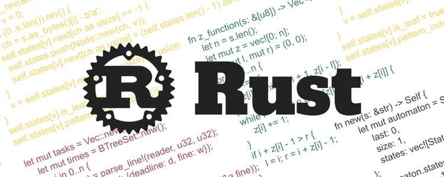

# Rust学习记录




## Rust下载安装
- [IDEA插件Rust](https://plugins.jetbrains.com/plugin/8182-rust)
- [Rust官网](https://www.rust-lang.org/)
- [`rustup-init`下载地址](https://www.rust-lang.org/zh-CN/tools/install)
- [Rust + Windows + Mingw安装](https://blog.csdn.net/m0_46479463/article/details/105271369)


### 配置步骤
1. 设置安装路径
    1. 设置环境变量`CARGO_HOME`来指定`cargo`的安装目录。
    1. 设置环境变量`RUSTUP_HOME`来指定`rustup`的安装目录。
2. 启动`rust-init.exe`来安装
    1. 检查打印的消息，查看`cargo’s bin directory`和`rustup home directory`是否正确
    2. 输入2选择`Customize Installition`
    3. 输入`Default host triple：x86_64-pc-windows-gnu`
    4. 后续直接按`Enter`键，使用默认参数
    5. 输入`1`直接安装
3. 安装默认`Toolchain`<br/>
使用命令`rustup toolchain install stable`安装默认toolchain。
4. 检查安装成功与否<br/>
`rustc --version`


## Rust学习资料
- [Rust在线编辑器](https://play.rust-lang.org/)
- [Rust文档](https://kaisery.github.io/trpl-zh-cn/title-page.html)
- [大佬Rust学习笔记](https://skyao.io/learning-rust/)

## Rust使用命令行参数
main()是个无参函数，想要实现读取命令行参数，可以这么做：
```rust
fn main() {
    let args = std::env::args();
    println!("{:?}", args);
}
```
想要读取这个东西的话，可以这么写：
```rust
fn main() {
    let args = std::env::args();
    for arg in args {
        println!("{}", arg);
    }
}
```

## Rust路径
- 绝对路径从`crate`关键字开始描述：`crate::nation::government::govern();`
- 相对路径从`self`或`super`关键字或一个标识符开始描述：`nation::government::govern();`

## Rust内存管理
Rust区别与其他高级语言的重要特征，在于其内存管理的两个特点：
1. 变量超出作用域会自动释放。对于简单值类型的栈内存(如int，struct)超出作用域后自动释放，这个逻辑在各个语言都有实现。而对于new出来的堆内存，在C/C++中是要手动释放的，在Java和DotNet中要委托垃圾回收释放或手动写dispose语句释放。而垃圾回收不是实时的，会影响性能。而释放语句总会有懒人忘记写的。而Rust对栈内存和堆内存一视同仁，超出作用域一律自动释放。Rust的这个特点在兼顾性能的情况下，有效的减少了代码量和内存泄漏隐患。
2. “所有权”：某段内存只能被最后的变量名所有，前面声明过的变量都作废，这有效的避免被多个变量释放的问题，而且该操作是在编译期就可以检查到的，这策略可在编译期就能有效的避免空指针问题。

## Rust泛型+特性+生命周期
```rust
fn longest_with_an_announcement<'a, T>(x: &'a str, y: &'a str, ann: T) -> &'a str
    where T: Display
{
    println!("Announcement! {}", ann);
    if x.len() > y.len() {
        x
    } else {
        y
    }
}
```

## Rust生命周期
[Rust生命周期介绍](https://www.runoob.com/rust/rust-lifetime.html)

## Rust的一些语言特点
1. 条件语句和循环语句不写小括号但支持写大括号
2. 支持类似于文档注释效果的函数注释等
3. 暂不支持`do...while`但保留了`do`关键词
4. Rust 中的路径分隔符是`::`
